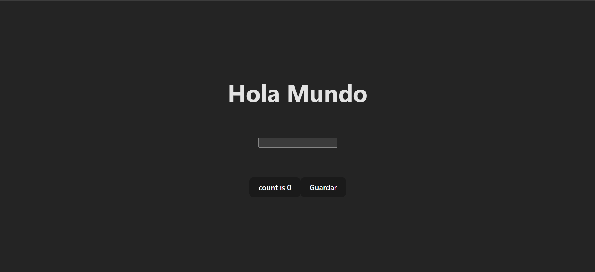

# **DEVOPS DUMMY - HOLAVITE**
# **REACT-VITE**

## Descripción del proyecto
Este proyecto dummy consiste en un FrontEnd contenerizado desarrollada en `React` usando la herramienta `Vite`, sus pruebas unitarias fueron desarrolladas utilizando `Jest` y `React Testing Library`.

## Funcionamiento
Este proyecto funciona capturando una palabra o frase que el usuario coloque, además de un botón el cual cuenta el número de clicks y un botón guardar que llama al backend desarrollado en Node que guarda la información en una base de datos Mongo.



## Objetivo
El objetivo principal de este proyecto es proporcionar un proyecto de prueba para el equipo DevOps. Se utiliza para realizar pruebas de los pipelines de CI/CD desarrollados en el repositorio `devops-pipeline-cicd`. 

Los pasos del pipeline incluyen:

- Compilación de código.
- Ejecución de pruebas unitarias.
- Despliegue de imágenes a Azure Container Registry.
- Despliegue de la aplicación en OpenShift preproductivo y productivo en el namespace `devopsdummy`.

---

## **Implementación en local de la aplicación Dummy**
Para desplegar localmente la aplicación Dummy, se pueden seguir dos métodos: sin Docker o con Docker.

### **Opción 1: Instalación sin Docker**
#### **Tecnologías necesarias**
- Node.js
- npm o yarn
- git

#### **Pasos de instalación y ejecución**
1. Clonar el repositorio:
   ```sh
   git clone https://github.com/jnpalomino-portfolio/devopsdummy-react-holavite-mfe-frontend.git
   ```
2. Ingresar a la carpeta del proyecto:
   ```sh
   cd devopsdummy-react-holavite-mfe-frontend
   ```
3. Instalar dependencias:
   ```sh
   npm install
   ```
4. Iniciar el proyecto en modo desarrollo (esto solo inicia el servidor, no ejecuta pruebas unitarias):
   ```sh
   npm run dev
   ```
5. Acceder a la aplicación en el navegador: [http://localhost:5173](http://localhost:5173)
6. (Opcional) Ejecutar pruebas unitarias:
   ```sh
   npm test
   ```
7. (Opcional) Ejecutar pruebas unitarias con cobertura:
   ```sh
   npm test -- --coverage
   ```

---

### **Opción 2: Instalación con Docker**
#### **Tecnologías necesarias**
- Docker Desktop
- git

#### **Pasos de instalación y ejecución**
1. Abrir Docker Desktop y asegurarse de que esté en ejecución.
2. Clonar el repositorio:
   ```sh
   git clone https://github.com/jnpalomino-portfolio/devopsdummy-react-holavite-mfe-frontend.git
   ```
3. Ingresar a la carpeta raíz del proyecto en una terminal:
   ```sh
   cd devopsdummy-react-holavite-mfe-frontend
   ```
4. Construir la imagen Docker:
   ```sh
   docker build -t devopsdummyreact:1 .
   ```
5. Ejecutar el contenedor:
   ```sh
   docker run -p 3000:3000 devopsdummyreact:1
   ```
6. Acceder a la aplicación en el navegador: [http://localhost:3000](http://localhost:3000)

---

## **Levantamiento del Backend**
Para levantar el backend de la aplicación es necesario clonar el [repositorio del Backend](https://AlcaldiaMedellin@dev.azure.com/AlcaldiaMedellin/DevOps%20Dummy/_git/devopsdummy-node-contador-ms-backend) y seguir los pasos descritos en su README.md.

---
